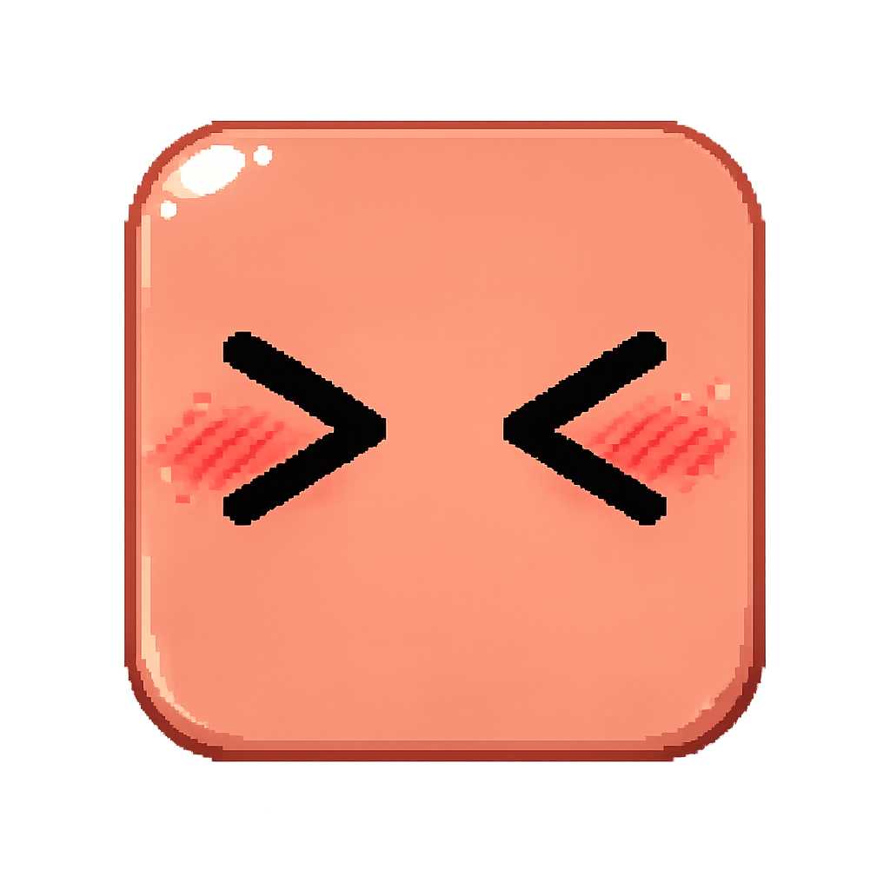
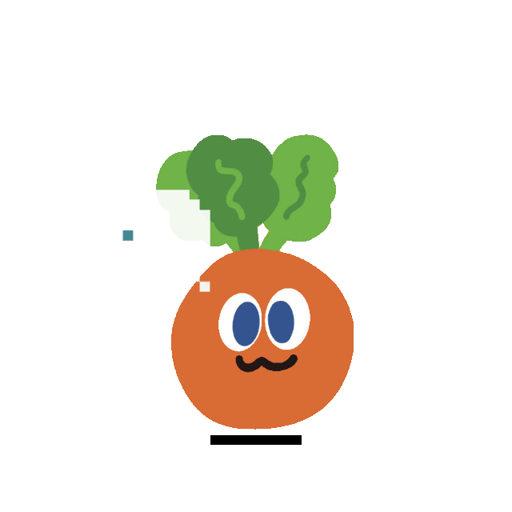
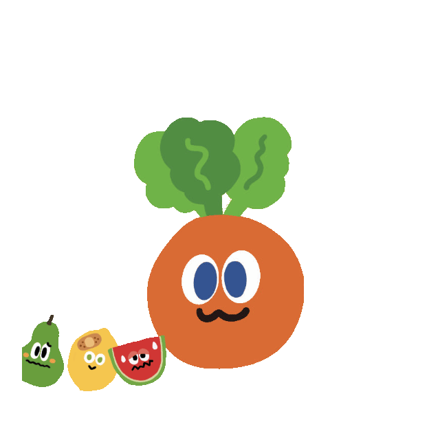
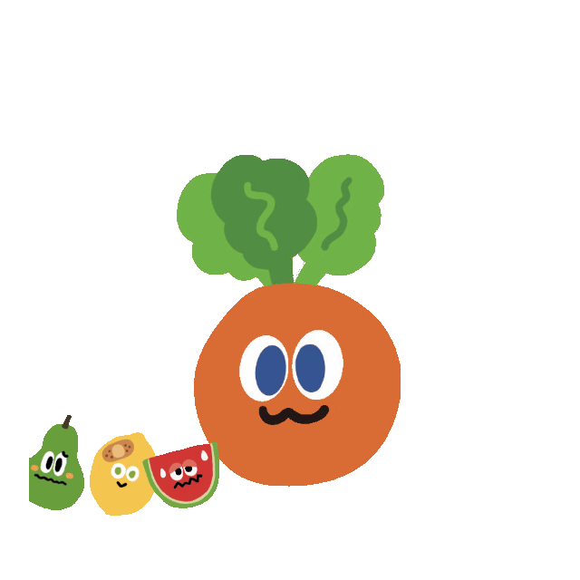
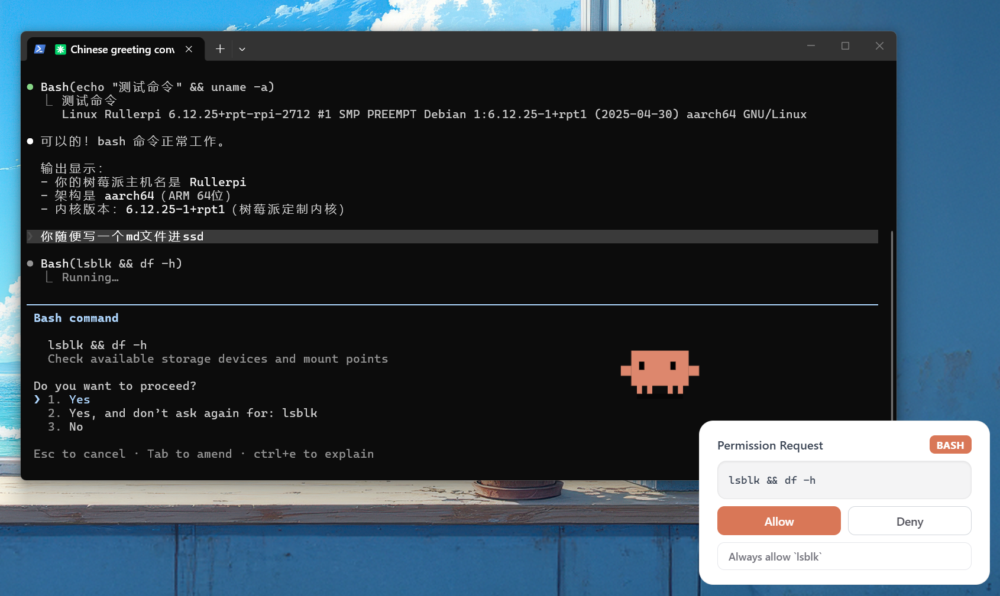

<p align="center">
  
</p>
<h1 align="center">Mojocarrot on Desk</h1>
<p align="center">
  <a href="README.md">English</a>
</p>

一个能实时感知 AI 编程助手工作状态的桌面宠物。这个项目基于公开仓库 [rullerzhou-afk/clawd-on-desk](https://github.com/rullerzhou-afk/clawd-on-desk) 改造而来，当前这个分支将其对外形态调整为 **Mojocarrot on Desk**：保留原项目的多 Agent 运行机制，同时把屏幕上的主角色替换为 **给 WMLS 们的 Mojocarrot**，并针对新角色重做了大量场景表演和动画节奏。

> 支持 Windows 11、macOS 和 Ubuntu/Linux。需要 Node.js。支持 **Claude Code**、**Codex CLI**、**Copilot CLI**、**Gemini CLI** 与 **Cursor Agent**。

## 功能特性

### Mojocarrot 角色分支
- **给 WMLS 们的 Mojocarrot** — 当前分支已将默认主角色替换为 Mojocarrot，但保留原项目的多 Agent、权限气泡、极简模式和会话状态机
- **基于原版重新编排动画** — 很多场景仍参考原版 Clawd 的母版节奏，但表情、道具、前景特效、点击反应和 mini 模式都已经按 Mojocarrot 重新设计
- **分层角色资源** — Mojocarrot 使用身体、叶子、眼睛、嘴巴、睡姿等拆分资源，而不是单张扁平贴图，便于做眼球追踪、睡眠过渡和场景化脸部处理
- **原项目 credit** — 当前分支沿用了原版 `clawd-on-desk` 的运行时架构、hook 模型和桌宠工作流，这里主要改的是 Mojocarrot 角色资源、动画节奏和对外展示

### 多 Agent 支持
- **Claude Code** — 通过 command hook + HTTP 权限 hook 完整集成
- **Codex CLI** — 自动轮询 JSONL 日志（`~/.codex/sessions/`），无需配置
- **Copilot CLI** — 通过 `~/.copilot/hooks/hooks.json` 配置 command hook
- **Gemini CLI** — 通过 `~/.gemini/settings.json` 配置 command hook（Clawd 启动时自动注册，或执行 `npm run install:gemini-hooks`）
- **Cursor Agent** — [Cursor IDE hooks](https://cursor.com/docs/agent/hooks)，配置在 `~/.cursor/hooks.json`（Clawd 启动时自动注册，或执行 `npm run install:cursor-hooks`）
- **多 Agent 共存** — 多个 Agent 可同时运行，Mojocarrot 独立追踪每个会话

### 动画与交互
- **实时状态感知** — 通过 Agent hook 和日志轮询自动驱动动画
- **角色化动画状态** — 待机、思考、打字、建造、杂耍、指挥、报错、开心、通知、扫地、搬运、睡觉，以及对应的 mini 模式与点击反应，均已调整为 Mojocarrot 版本
- **眼球追踪** — 待机状态下 Mojocarrot 跟随鼠标，身体微倾，影子拉伸
- **睡眠序列** — 60 秒无活动 → 打哈欠 → 打盹 → 倒下 → 睡觉；移动鼠标触发惊醒弹起动画
- **点击反应** — 双击戳戳，连点 4 下东张西望
- **任意状态拖拽** — 随时抓起 Mojocarrot（Pointer Capture 防止快甩丢失），松手恢复当前动画
- **极简模式** — 拖到右边缘或右键"极简模式"；Mojocarrot 藏在屏幕边缘，悬停探头，通知/完成有迷你动画，抛物线跳跃过渡

### 权限审批气泡
- **桌面端权限审批** — Claude Code 请求工具权限时，Mojocarrot 弹出浮动卡片，无需切回终端
- **允许 / 拒绝 / 建议** — 一键批准、拒绝，或应用权限规则（如"始终允许 Read"）
- **堆叠布局** — 多个权限请求从屏幕右下角向上堆叠
- **自动关闭** — 如果你先在终端回答了，气泡自动消失

### 会话智能
- **多会话追踪** — 多个 Claude Code 会话自动解析到最高优先级状态
- **子代理感知** — 1 个子代理杂耍，2 个以上指挥
- **终端聚焦** — 右键 Mojocarrot → 会话菜单，一键跳转到对应会话的终端窗口；通知/注意状态自动聚焦相关终端
- **进程存活检测** — 检测已崩溃/退出的 Claude Code 进程，10 秒内清理孤儿会话
- **启动恢复** — 如果 Mojocarrot on Desk 在 Claude Code 运行期间重启，会保持清醒等待 hook，而不是直接睡觉

### 系统
- **点击穿透** — 透明区域的点击直接穿透到下方窗口，只有角色本体可交互
- **位置记忆** — 重启后 Mojocarrot 回到上次的位置（包括极简模式）
- **单实例锁** — 防止重复启动
- **自动启动** — Claude Code 的 SessionStart hook 可在 Mojocarrot on Desk 未运行时自动拉起
- **免打扰模式** — 右键或托盘菜单进入休眠，所有 hook 事件静默，直到手动唤醒 Mojocarrot
- **系统托盘** — 调大小（S/M/L）、免打扰、语言切换、开机自启、检查更新
- **国际化** — 支持英文和中文界面，右键菜单或托盘切换
- **自动更新** — 检查 GitHub release；Windows 退出时安装 NSIS 更新包，macOS 打开 release 页面，Linux 需手动下载

## 状态映射

> 下面这张表以当前 Mojocarrot 分支的实际行为为准，预览 GIF 也已经基于当前 Mojocarrot 资产重新生成，并统一改为透明背景，便于嵌入文档或页面。

| Claude Code 事件 | Mojocarrot 状态 | 动画 | |
|---|---|---|---|
| 无活动 | 待机 | 眼球跟踪 |  |
| 无活动（随机） | 待机 | 看书 |  |
| 无活动（随机） | 待机 | 侦探巡逻 |  |
| UserPromptSubmit | 思考 | 思考泡泡 |  |
| PreToolUse / PostToolUse | 工作（打字） | 打字 |  |
| PreToolUse（3+ 会话） | 工作（建造） | 建造 |  |
| SubagentStart（1 个） | 杂耍 | 杂耍 |  |
| SubagentStart（2+） | 指挥 | `ultrathink` 风格的高频调度态 |  |
| PostToolUseFailure / StopFailure | 报错 | ERROR + 冒烟 |  |
| Stop / PostCompact | 注意 | 开心蹦跳 |  |
| PermissionRequest / Notification | 通知 | 惊叹跳跃 |  |
| PreCompact | 扫地 | 扫帚清扫 |  |
| WorktreeCreate | 搬运 | 前景水果小队跑过 |  |
| 60 秒无事件 | 睡觉 | 睡眠序列 |  |

### 极简模式

将 Mojocarrot 拖到屏幕右边缘（或右键 →"极简模式"）进入。Mojocarrot 藏在屏幕边缘只露出半身，鼠标悬停时探出来。

| 触发 | 极简反应 | |
|---|---|---|
| 默认 | 呼吸 + 眨眼 + 眼球追踪 |  |
| 鼠标悬停 | 从屏幕边缘探出来 |  |
| 通知 / 权限请求 | 感叹号弹出 + >< 挤眼 |  |
| 任务完成 | 烟花棒庆祝 |  |
| Peek 时点击 | 退出极简模式（抛物线跳回） | |

### 点击反应

当前 Mojocarrot 的点击反应逻辑如下：

| 触发方式 | 反应 | 预览 |
|---|---|---|
| 点击脸的左半边 | `react-left` 左侧张望 |  |
| 点击脸的右半边 | `react-right` 右侧张望 |  |
| 连续点击 | `react-annoyed` panic 风格 annoyed 反应 |  |
| 快速四击 | `react-double` 水果小队跑过 |  |
| 快速四击 | `react-double-jump` 惊跳 |  |
| 快速四击 | `react-wizard` 青苹果变身 |  |
| 拖拽桌宠 | `react-drag` 整体摇晃 |  |

## 快速开始

```bash
# 克隆仓库
git clone https://github.com/lukelei2025/mojocarrot-on-desk.git
cd mojocarrot-on-desk

# 安装依赖
npm install

# 启动 Mojocarrot on Desk
npm start
```

现在这个仓库已经可以按一个独立的 Mojocarrot 项目直接安装和运行，不需要先安装上游 `clawd-on-desk` 再覆盖资源。

### 远程 SSH 模式（Claude Code & Codex CLI）



Mojocarrot on Desk 支持通过 SSH 反向端口转发感知远程服务器上的 AI Agent 状态。Hook 事件和权限请求通过 SSH 隧道传回本地桌面端，无需修改桌宠本体代码。

**一键部署：**

```bash
bash scripts/remote-deploy.sh user@远程主机
```

脚本会将 hook 文件复制到远程服务器，以远程模式注册 Claude Code hooks，并打印 SSH 配置指引。

**SSH 配置**（添加到本地 `~/.ssh/config`）：

```
Host my-server
    HostName 远程主机
    User user
    RemoteForward 127.0.0.1:23333 127.0.0.1:23333
    ServerAliveInterval 30
    ServerAliveCountMax 3
```

**工作原理：**
- **Claude Code** — 远程 hook 将状态 POST 到 `localhost:23333`，SSH 隧道转发回本地 Mojocarrot on Desk。权限气泡也能正常弹出——HTTP 往返通过隧道完成。
- **Codex CLI** — 独立的日志监控脚本（`codex-remote-monitor.js`）在远程轮询 JSONL 文件，通过同一隧道 POST 状态变化。在远程启动：`node ~/.claude/hooks/codex-remote-monitor.js --port 23333`

远程 hook 以 `CLAWD_REMOTE` 模式运行，跳过 PID 采集（远程 PID 在本地无意义）。远程会话不支持终端聚焦。

> 感谢 [@Magic-Bytes](https://github.com/Magic-Bytes) 提出 SSH 隧道方案（[#9](https://github.com/rullerzhou-afk/clawd-on-desk/issues/9)）。

### macOS 说明

- **源码运行**（`npm start`）：Intel 和 Apple Silicon 均可直接使用。
- **DMG 安装包**：未签名 Apple 开发者证书，macOS Gatekeeper 会拦截。解决方法：
  - 右键点击应用 → **打开** → 在弹窗中点击 **打开**，或
  - 在终端运行 `xattr -cr /Applications/Mojocarrot\ on\ Desk.app`

### Linux 说明

- **源码运行**（`npm start`）：自动传入 `--no-sandbox` 参数，跳过 chrome-sandbox SUID 校验。
- **安装包**：AppImage 和 `.deb` 可从 [GitHub Releases](https://github.com/lukelei2025/mojocarrot-on-desk/releases) 下载。deb 安装后应用图标会出现在 GNOME 应用菜单。
- **终端聚焦**：依赖 `wmctrl` 或 `xdotool`（有一个就行）。安装：`sudo apt install wmctrl` 或 `sudo apt install xdotool`。
- **自动更新**：Linux 暂不支持自动更新，请从 GitHub Releases 手动下载新版本。

## 已知限制

| 限制 | 说明 |
|------|------|
| **Codex CLI：无法跳转终端** | Codex 通过 JSONL 日志轮询，日志中不含终端 PID，点击桌宠无法跳转到 Codex 终端。Claude Code 和 Copilot CLI 正常。 |
| **Codex CLI：Windows hooks 禁用** | Codex 在 Windows 上硬编码禁用了 hooks，因此走日志轮询，延迟约 1.5 秒（hook 方式几乎无延迟）。 |
| **Copilot CLI：需手动配置 hooks** | Copilot 需要手动创建 `~/.copilot/hooks/hooks.json`。Claude Code 和 Codex 开箱即用。 |
| **Copilot CLI：无权限气泡** | Copilot 的 `preToolUse` 只支持拒绝，无法做完整的允许/拒绝审批流。权限气泡仅支持 Claude Code。 |
| **macOS/Linux 自动更新** | macOS 无 Apple 代码签名，Linux 不支持自动更新，均需从 GitHub Releases 手动下载。 |
| **Electron 主进程无自动化测试** | 单元测试覆盖了 agent 配置和日志轮询，但状态机、窗口管理、托盘等 Electron 逻辑暂无自动化测试。 |

## 致谢

本项目基于公开仓库 [rullerzhou-afk/clawd-on-desk](https://github.com/rullerzhou-afk/clawd-on-desk) 改造而来。原项目的概念、主体实现和社区积累，完整 credit 归属于原作者及其贡献者。

Mojocarrot 角色及相关品牌形象归属于 [STAYREAL](https://tw.istayreal.com/)。本仓库是面向 WMLS 社群的非官方、非商业化 fan project，与 STAYREAL 不存在隶属、背书或官方合作关系。

## 许可证

本仓库中的代码继续沿用上游 `clawd-on-desk` 的 MIT 许可证。

与 Mojocarrot 相关的角色权利、商标与品牌资产仍归 STAYREAL 所有，不因 MIT 许可证而转移；本项目仅作为非商业化 fan project 分享。
